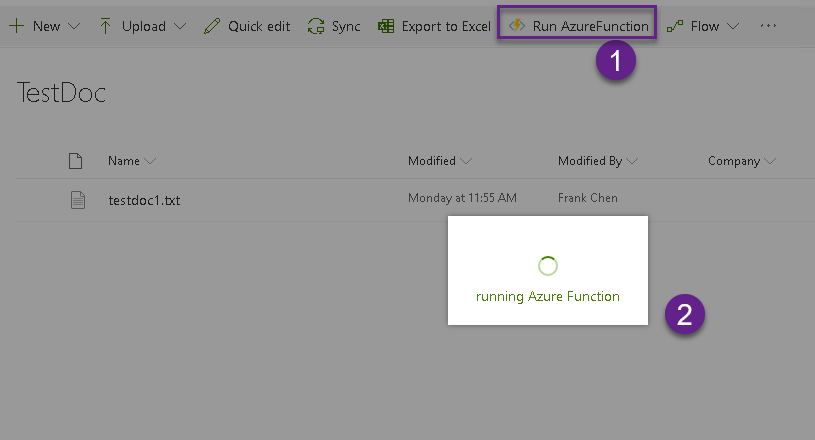
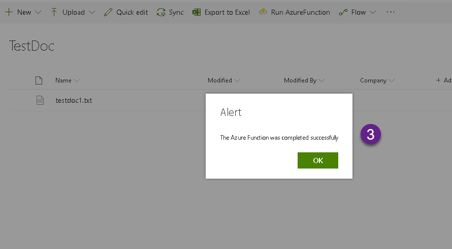
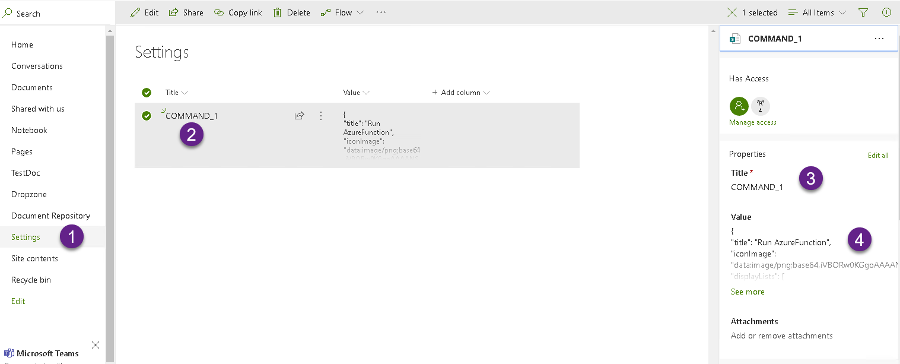

## spodoc-button

This is a sample to show how to create SPFx extension button to connect to a Azure Function. The button will be shown at document libraries. 





### Instruction
* Create a "Settings" list
* Add single text column and name it as "Value". 
* Add a list item: 
  * Title: COMMAND_1
  * Value: setting JSON of buttone. 
    * title: the Button title.
    * iconImage: the Button icon image base64 or url
    * displayLIsts: a list of list/library title which you want to show this button.
    * apiUrl: the web api URL you want to trigger. 
```json
{
    "title": "[button title]",
    "iconImage": "[icon image base64 or image url]",
    "displayLists": [
        "[document/list title]"
    ],
    "apiUrl": "[web api url]"
}

```

### Building the code

```bash
git clone the repo
npm i
npm i -g gulp
gulp
```

This package produces the following:

* lib/* - intermediate-stage commonjs build artifacts
* dist/* - the bundled script, along with other resources
* deploy/* - all resources which should be uploaded to a CDN.

### Build options

gulp clean - TODO
gulp test - TODO
gulp serve - TODO
gulp bundle - TODO
gulp package-solution - TODO
