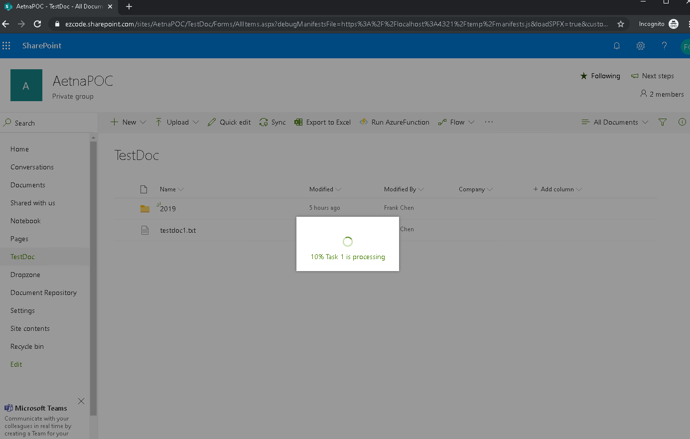

## spodoc-button

This is a sample to show how to create SPFx extension button to connect to a Azure Function. The button will be shown at document libraries. 


the button is also able to process Azure Function return 202 accepted. the logic will look at the statusQueryGetUri from 202 status
```json
{
    "id": "f5f0e03153b547b1bb04b1015d232957",
    "statusQueryGetUri": "[url]",
    "sendEventPostUri": "[url]",
    "terminatePostUri": "[url]",
    "rewindPostUri": "[url]",
    "purgeHistoryDeleteUri": "[url]"
}
```

If statusQueryGetUri call is able to return the customStatus showed the following json, the progress and message will be shown. 
```json
{
    "name": "MainFunction",
    "instanceId": "f5f0e03153b547b1bb0",
    "runtimeStatus": "Running",
    "input": null,
    "customStatus": {
        "Process": 60,
        "Message": "Task 6 is processing"
    },
    "output": null,
    "createdTime": "2019-11-04T06:04:56Z",
    "lastUpdatedTime": "2019-11-04T06:05:15Z"
}
```



When a Azure Function is called, the following data will be POST to the endpoint: 

```json
{
    "siteUrl": "[site url]",
    "listTitle": "[list title]",
    "listId":"[list id]",
    "currentFolder": "[current folder in list/lib]"
}
```

### Instruction
* Create a "Settings" list
* Add single text column and name it as "Value". 
* Add a list item: 
  * Title: COMMAND_1
  * Value: setting JSON of buttone. 
    * title: the Button title.
    * refreshPage: whether or not refresh the page after the call.
    * displayLIsts: a list of list/library title which you want to show this button.
    * apiUrl: the web api URL you want to trigger. 
    * iconImage: the Button icon image base64 or url
```json
{
    "title": "[button title]",
    "refreshPage": true,
    "displayLists": [
        "[document/list title]"
    ],
    "apiUrl": "[web api url]",
    "iconImage": "[icon image base64 or image url]"
}

```

### Building the code

```bash
git clone the repo
npm i
npm i -g gulp
gulp
```

This package produces the following:

* lib/* - intermediate-stage commonjs build artifacts
* dist/* - the bundled script, along with other resources
* deploy/* - all resources which should be uploaded to a CDN.

### Build options

gulp clean - TODO
gulp test - TODO
gulp serve - TODO
gulp bundle - TODO
gulp package-solution - TODO
